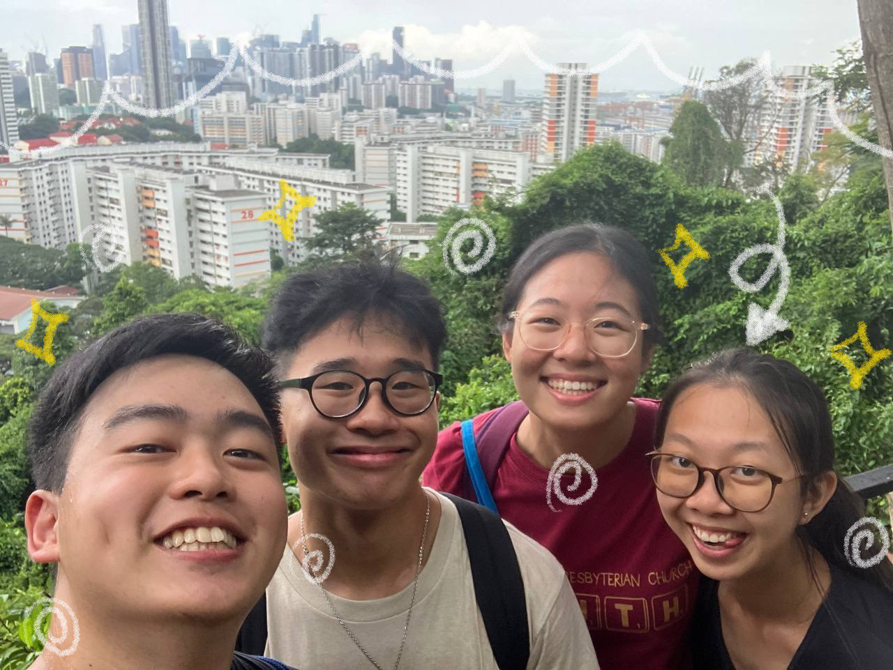

## introduction

Hi! My name is Bethel Loke but I go by "Beth". I'm currently a Year 2 student in Singapore Management University (SMU) studying BSc. Computing and Law. I enjoy making music, coding, writing, and game development. I'm also part of SMU's A capella group called SMU VOIX ("vuu-wah"). In my free time, I boulder, skate, and cycle with my friends, which is a favourite past time. I hope to be able to achieve my dream of having a legal-tech startup of my own one day! 

## what's this for?

I came up with the idea to build a personal site that displays in the style of coding documentation for two reasons.

* I haven't seen anyone do this before
* Starlight Astro (the template I'm building this website atop) has a beautifully sorted hierarchial structure that I can format to fit my needs

Everything here will literally be documentation -- about my life, about my goals, hobbies, thoughts, feelings, projects, accomplishments... you name it. It's also fulfilling to have a comprehensive page to display who you are as a person -- kind of a "summary".

## how do i navigate?

There are a few categories to the left of your screen (if you're on a computer) that you can use to click through the topics you are interested in. It's currently sorted into a few categories, including `main` and `projects`. You can also read through this like a book and go through every single page if that's your style! 

Think of this as documentation for a coding project -- if you want to, you can find out all about it by navigating it linearly. Likewise, hopping around to only look at the parts you're interested in is quite conventional too. Whatever suits your style.

With that said, you can either see a few pictures of me by clicking the button on the bottom of the screen or you can start jumping to other pages. Happy vibes!