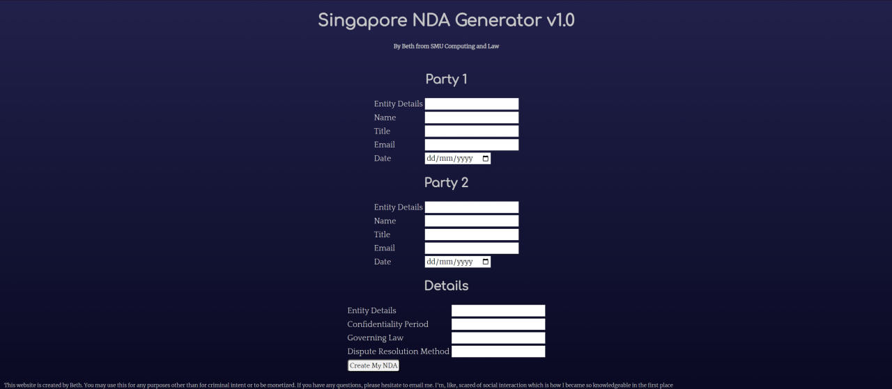

## nda generator

Non Disclosure Agreements are an integral part of society. There are some secrets that cannot be disclosed and would require a legally binding agreement in order to ensure this information isn't leaked. For one of my very first completed automation challenges, I wanted to take the PDF template from OneNDA and create my own form submission front-end for a user to create their own NDA!

The stack I used consisted of my own personal favourites, `svelte`, `python` and `flask`! I didn't really have a database as the file would be written directly into `TeX`. I'd amend a `TeX` file that had a set of predefined parameters that the user could fill in. Upon generation, it would put the product directly into the same folder as the code base.

I learned a lot from this project in particular. It was the first one I had ever completed that had some real world value. And although I'm not hosting it on a website, I think it serves as a good reminder that this is where I started and it'll only go up from here!

*placeholder wip*

## short video summarizer

*placeholder wip*

The idea to summarize videos into short text came from me not wanting to pay attention to lectures but still grasping the main points. Eventually, I settled for short YouTube video summaries for reasons that will be outlined later on in this section.

I built the entirety of the project using Python and its packages. I used `Gradio` for the frontend (even though it's really meant for Machine Learning, I found that it produces really clean UI blocks that are so intuitive to use), had a visual `yt-dlp` button, and utilized `whisper` by *OpenAI* to extract the text. Finally, it all went into the `openai` *ChatGPT* API to summarize the text.

Of course, there are some limitations with this. As there is a word count due to the length of the video, it was a bit impossible doing this for videos over 10 minutes long. Fortunately, I have found a solution which I might implement in the future. I've recently discovered the existence of `langchain`, a module which would allow me to break down longer documents into vectors for a vector based storage solution. Though, honestly, I'm so new to this that I can only experiment with it right now.

## voix telegram bot

