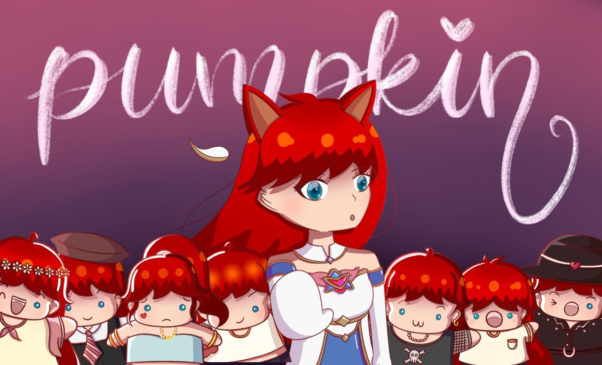

## what's in this section?

Here's where I'm going to put all the small accomplishments that I have that aren't big enough to constitute an entire project! With this tiny showcase section, I hope to show off some of the little accomplishments I have racked up over the years in one place.

There are 4 categories of items, so here's the general rundown of what each one does!

* **Automation:** Tiny projects where I spend a few days automating a simple task to practice my coding skills
* **Music:** Original songs, cover songs, and more insight into my capabilities!
* **Visual Art:** Display of assets that I have drawn and works that I am proud of
* **Words:** Essays, short stories, generally -- *words*

Hope you enjoy looking around this section (between you and me, it's *definitely* my favourite).