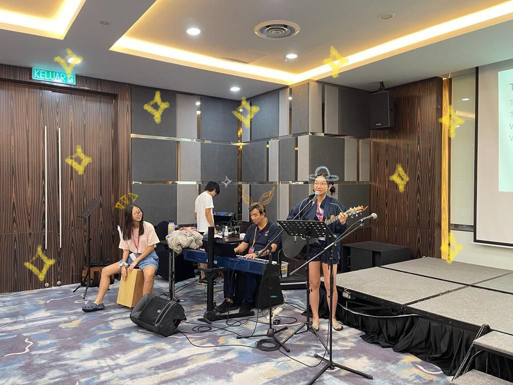

## originals

### prisoner of the air

I wrote this song when I was 18. When I first conceptualized it, I had actually planned to make it a song about attraction and romance, owing to the influence of the quantity of songs that touch the topic. As it evolved, it somehow became a meta-commentary on the freedom of speech from the perspective of a gentleman who realised that the system (whatever that implies) was working against them. Honestly, it doesn't even feel like I wrote it. But here it is.

<iframe width="100%" height="300" scrolling="no" frameborder="no" allow="autoplay" src="https://w.soundcloud.com/player/?url=https%3A//api.soundcloud.com/tracks/1648982946&color=%23ff5500&auto_play=false&hide_related=false&show_comments=true&show_user=true&show_reposts=false&show_teaser=true&visual=true"></iframe>
<a href="https://soundcloud.com/huitingloke" title="huitingloke" target="_blank" style="color: #cccccc; text-decoration: none;">huitingloke</a> · <a href="https://soundcloud.com/huitingloke/prisoner-of-the-air" title="Prisoner Of The Air" target="_blank" style="color: #cccccc; text-decoration: none;">Prisoner Of The Air</a>

### sea of red

I don't remember writing this song. It felt like it was done in a haze, where I was only half conscious of the words I was typing into the document. The melody came so easily, the words so hauntingly, and yet, to this day, I don't understand what I wrote. It might sound strange but I don't even think this song makes sense on a literal level. I'm sure it has some emotional value but that's only if you try to interpret it in an abstract manner. How about you listen to this, and you tell me? 

<iframe width="100%" height="300" scrolling="no" frameborder="no" allow="autoplay" src="https://w.soundcloud.com/player/?url=https%3A//api.soundcloud.com/tracks/1648980300&color=%23ff5500&auto_play=false&hide_related=false&show_comments=true&show_user=true&show_reposts=false&show_teaser=true&visual=true"></iframe>
<a href="https://soundcloud.com/huitingloke" title="huitingloke" target="_blank" style="color: #cccccc; text-decoration: none;">huitingloke</a> · <a href="https://soundcloud.com/huitingloke/sea-of-red" title="Sea Of Red" target="_blank" style="color: #cccccc; text-decoration: none;">Sea Of Red</a>

### roses

This is one of my favourite songs. I composed something akin to an album when I was 18, and this was one of the ones which I really felt would speak to me in the future. Like a message from Squid to Beth, I know that it's something that I would have to learn from with my younger self.

*wip*

## covers

### temporary bliss

I am a diehard fan of punk rock music or anything that fits this category. When I first heard this song, I was enraptured by the chorus. It's addictive and the whole song conveys such a harsh story. I really liked it... so much so that I spent 5 days hyperfocussing on my first ever A capella arrangement to produce this. I hope you like it.

<iframe width="100%" height="300" scrolling="no" frameborder="no" allow="autoplay" src="https://w.soundcloud.com/player/?url=https%3A//api.soundcloud.com/tracks/1640649597&color=%23ff5500&auto_play=false&hide_related=false&show_comments=true&show_user=true&show_reposts=false&show_teaser=true&visual=true"></iframe>
<a href="https://soundcloud.com/huitingloke" title="huitingloke" target="_blank" style="color: #cccccc; text-decoration: none;">huitingloke</a> · <a href="https://soundcloud.com/huitingloke/temporary-bliss-arrangement" title="Temporary Bliss Arrangement" target="_blank" style="color: #cccccc; text-decoration: none;">Temporary Bliss Arrangement</a>

### everything goes on

I first heard this song from the Star Guardian portion of League of Legends. To say it was moving would be an understatement. I couldn't (and still cannot) explain what in its harmonies was so hauntingly lilting. What followed was a three-day-caffeine-induced-hyperfocussed arrangement with 1 ukulele, 1 guitar, a five (or so) part harmony and the world's worst mixing. Everything does go on.

<iframe width="100%" height="300" scrolling="no" frameborder="no" allow="autoplay" src="https://w.soundcloud.com/player/?url=https%3A//api.soundcloud.com/tracks/1640654106&color=%23ff5500&auto_play=false&hide_related=false&show_comments=true&show_user=true&show_reposts=false&show_teaser=true&visual=true"></iframe>
<a href="https://soundcloud.com/huitingloke" title="huitingloke" target="_blank" style="color: #cccccc; text-decoration: none;">huitingloke</a> · <a href="https://soundcloud.com/huitingloke/everything-goes-on" title="Everything Goes On" target="_blank" style="color: #cccccc; text-decoration: none;">Everything Goes On</a>

### remembering sunday

Great song. That's all!

<blockquote class="tiktok-embed" cite="https://www.tiktok.com/@dobesquiddy/video/7290820050645191938" data-video-id="7290820050645191938" style="max-width: 605px;min-width: 325px;" > <section> <a target="_blank" title="@dobesquiddy" href="https://www.tiktok.com/@dobesquiddy?refer=embed">@dobesquiddy</a> 

 <a target="_blank" title="♬ original sound  - beth" href="https://www.tiktok.com/music/original-sound-beth-7290820397283527426?refer=embed">♬ original sound  - beth</a> </section> </blockquote> 

## instruments

### guitar

I've been trying to rack my head as to when I properly learned how to play the guitar, but I honestly can't remember. All I know is that my dad and older sister have always been rather adept at it while I learned a few basic chords and strummed along to pop songs. I recall being able to strum out *Call Me Maybe* and *Viva La Vida* when I was around seven and I had a decent grasp over nine reusable chords at nine. 

To this day, I'm still not particularly comfortable with plucking as I was never classically trained, but I can make decent dynamic arrangements on the fly. 

<blockquote class="tiktok-embed" cite="https://www.tiktok.com/@dobesquiddy/video/7289714000089058562" data-video-id="7289714000089058562" style="max-width: 605px;min-width: 325px;" > <section> <a target="_blank" title="@dobesquiddy" href="https://www.tiktok.com/@dobesquiddy?refer=embed">@dobesquiddy</a> 
some kinda rewrite from like 2019 idk
 <a target="_blank" title="♬ original sound - dobesquiddy - beth" href="https://www.tiktok.com/music/original-sound-dobesquiddy-7289714120922843905?refer=embed">♬ original sound - dobesquiddy - beth</a> </section> </blockquote> 

### piano

### drums

### cajon

I've been playing cajon on and off for a while. It's not something I would consider to be my main instrument, mostly because I don't find it particularly accessible to carry around. But most of the drumming beats I have learned I found apply to this as well. Last time I played it performatively was for Church Camp in 2023. It's overall really fun and a good starting instrument to get into/good instrument to pick up if you have previous experience.

### kazoo

This is kind of a troll, but I wanted to put it here because I thought it would be funny. I just like kazoos because I can effortlessly sound like Donald Duck. My goal here is to do a kazoo arrangement. I'm so sorry for your loss.